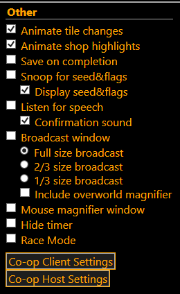
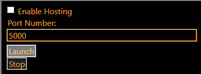
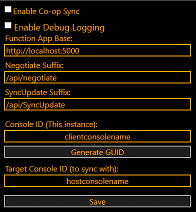

# Using Self-Hosted Coop in Z-Tracker Version 2.1.0.2+

# Concepts

In the Self-Hosted version of Coop in Z-Tracker one player is the “Host” and both players are the “Client”.

The Host will run a local SignalR server, configured via the Z-Tracker console, that will function as a communication hub. Both Clients will connect to that Host and automatically synchronize that way.

# Hosting Coop

After initially launching the Z-Tracker console, the Host should click the button Co-op Host Settings in the lower right-hand corner of the “Other” Settings:  

Clicking that button will open the following window:

## 
## Window Settings

* **Enable Hosting**: When this box is checked the option to “Launch” becomes available. This is to ensure that hosting is confirmed as desirable  
* **Port Number**: The self-hosted SignalR server will be hosted at this Port. For otherwise connections this port will need to be open for inbound connections on the machines firewall and likely will need port forwarding enabled at the router level to ensure all calls with that port number go to the machine in question  
* **Launch:** This actively starts the SignalR server  
* **Stop:** This stops the SignalR server. If a port number change is desired, stop the server, change the value, then relaunch

## Recommended Steps

* The host should launch this before any clients attempt to connect  
* The host will likely need to know their own external IP address in order to provide it to the client. Many online options exist to confirm this  
* Double and triple check that the port number is open in Windows Firewall as well as with port forwarding.   
  * On Windows this is best accomplished with either PowerShell or the command line for troubleshooting purposes:  
    * PowerShell  
      * Test-NetConnection \<IP\_or\_Hostname\> \-Port \<PortNumber\>  
    * Command Line  
      * telnet \<IP\_or\_Hostname\> \<PortNumber\>

# Connecting to Coop

Both players will need to have the Z-Tracker launched, and once the Host has enabled the SignalR server, both players will need to click the “Co-op Client Settings” button in the lower right-hand corner of the Other section of settings:  

## Window Settings

* **Enable Co-op Sync**: Checking this box before clicking “Save” will begin the process of sending and attempting to receive data from other Z-Tracker instances. If unchecked all edits to this screen will be retained only as settings changes but not activated  
* **Enable Debug Logging**: If coop does not function normally, checking this box and then clicking “Save” will write additional logging information in real time to the command line window in the background  
* **Function App Base**: This is the URL of the target SignalR host. If the Host and the Client are the same person, then likely [http://localhost](http://localhost):\<port\> will suffice. The port in this instance is the port number determined at the hosting stage and will default to 5000\. If this is the client, the URL will need to be something that points at the host machine and in the most simplistic example will be http://\<publicIPaddress\>:\<port\>. (ex: [https://96.158.23.121:5000](https://96.158.23.121:5000) if the public IP address of the Host is 96.158.23.121 and the port chosen in the Host setup is 5000\)  
* **Negotiate Suffix**: Only used in Azure hosted SignalR instances and multiconsole SignalR instances. Leave as the default when self-hosting  
* **SyncUpdate Suffix**:Only used in Azure hosted SignalR instances and multiconsole SignalR instances. Leave as the default when self-hosting  
* **Console ID (This instance)**: What do you want your console to be known as? You can type any name of your choice or generate a random GUID in this space. The other Z-Tracker user will need to know this name exactly to ensure syncing  
* **Target Console ID (to sync with)**: The name chosen by the other Z-Tracker user for their console. Type that name here exactly.

## Recommended Steps

* Check the Enable Co-op Sync box  
* Fill in the URL of the Host (or localhost if you are also the Host)  
* Choose a name for your console and provide it to the other player  
* Insert the name of the other players console into the appropriate field  
* Click Save  
* Play as normal
